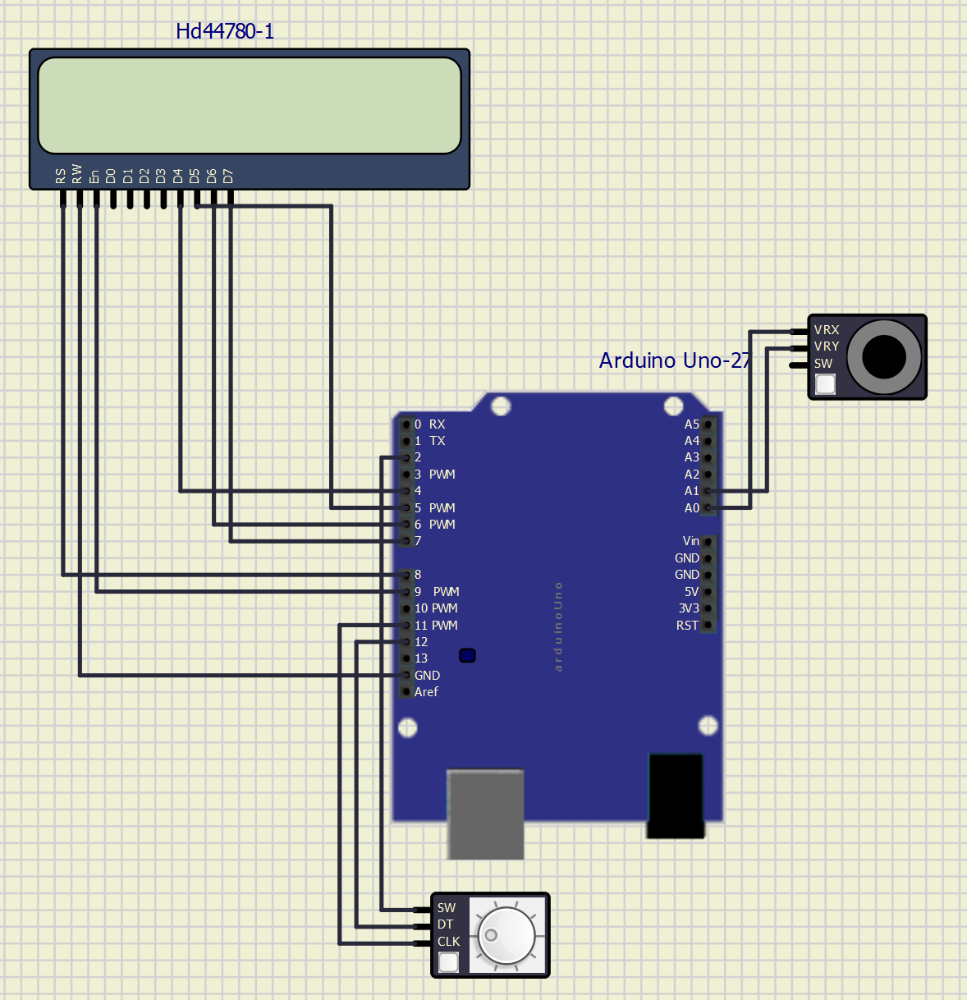

# Projekt 1

Applikácia analogového joy-sticku (2 ADC kanály, 1 tlačítko), rotačný enkóder, a Digilent PmodCLP LCD modul.

## Recommended GitHub repository structure

   ```c
   YOUR_PROJECT        // PlatfomIO project
   ├── include         // Included files
   ├── lib             // Libraries
   ├── src             // Source file(s)
   │   └── main.c
   ├── test            // No need this
   ├── platformio.ini  // Project Configuration File
   └── README.md       // Report of this project
   ```

## Členovia týmu

* Natália Pločeková (zodpovedná za kód, schému, video)
* Petra Slotová (zodpovedá za kód schému, flowchart)

## Popis zapojenia hardwaru

### Joystick
* GND na GND
* +5V na +5V
* VRx a VRy na analogové piny A0 a A1

### Rotačný enkóder
* GND na GND
* +5V na +5V
* CLK a DT na digitálne piny 11 a 12
* SW na digitálny pin 2

### Digilent PmodCLP LCD modul

pripojenie v simulátore SimulIDE
* RW sa pripojí na GND
* Rs a En na digitálne piny 8 a 9
* vstupné piny displeja D4 až D7  pripojíme na digitálne piny 4 až 7

pripojenie v reále
J1 - spodná polovica
* piny 7 až 10 pripojíme na digitálne piny 4 až 7
* GND na GND
* VCC na +5V
J2
* RW sa pripojí na GND
* Rs a En na digitálne piny 8 a 9


Obr. 1 - Zapojenie v programe SimulIDE


Obr. 2 - Zapojenie v reále

## Popis softvéru

Put flowchats of your algorithm(s). Write descriptive text of your libraries and source files. Put direct links to these files in `src` or `lib` folders.

## Video

Insert a link to a short video with your practical implementation example (1-3 minutes, e.g. on YouTube).

## Zdroje

1. Write your text here.
2. ...
